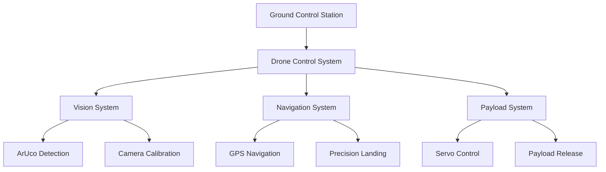
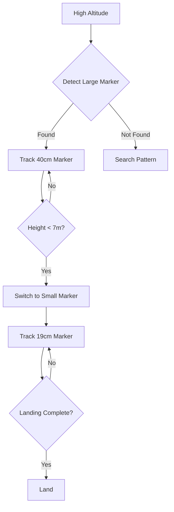
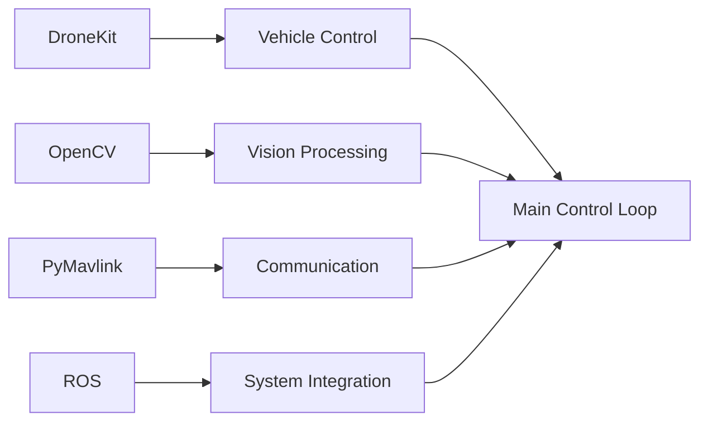
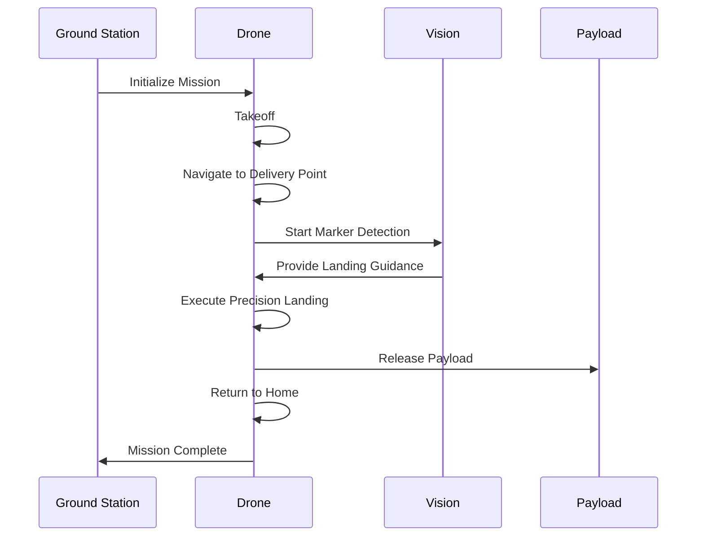
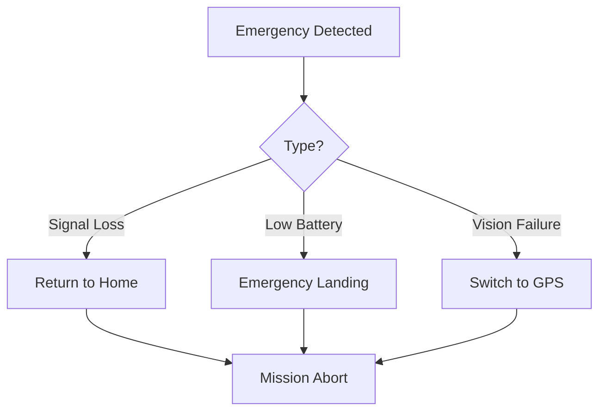

# Autonomous Drone Delivery System
## Author: Md Khairul Islam
- Institution: Hobart and William Smith Colleges, Geneva, NY
- Major: Robotics and Computer Science
- Contact: khairul.islam@hws.edu

## Project Overview

This project implements an autonomous drone delivery system capable of precise navigation, vision-based landing, and automated payload delivery. The system uses ArUco markers for precision landing and includes a complete delivery workflow from takeoff to return-to-home.

### System Architecture



### Precision Landing System



## System Components

### 1. Hardware Requirements

#### Drone Platform
- Flight Controller: Pixhawk/Navio2
- Companion Computer: Raspberry Pi 4
- Camera: Raspberry Pi Camera V2
- GPS: External GPS module
- Rangefinder: TF Mini Plus/LeddarOne
- Servo mechanism for payload delivery

#### Ground Station
- Computer running Linux
- Radio telemetry system

### 2. Software Architecture



### 3. Vision System

#### ArUco Marker Configuration
- High Altitude Marker:
  * ID: 129
  * Size: 40cm
  * Usage: Initial approach
- Low Altitude Marker:
  * ID: 72
  * Size: 19cm
  * Usage: Precision landing

#### Camera Setup
```python
Camera Parameters:
- Resolution: 640x480
- FOV: 62.2° horizontal, 48.8° vertical
- Calibrated using OpenCV
```

## Software Components

### Core Scripts

1. **arm_test.py**
   - Basic vehicle arming
   - Mode switching
   - Connection testing

2. **control_servo.py**
   - Payload mechanism control
   - PWM signal management
   - Servo positioning

3. **precision_landing_single_aruco.py**
   - Single marker detection
   - Basic landing sequence
   - Vision processing

4. **precision_landing_double_aruco.py**
   - Dual marker system
   - Altitude-based switching
   - Enhanced precision

5. **taco_delivery.py**
   - Complete delivery workflow
   - Navigation control
   - Payload management

### Delivery Workflow



## Installation

### 1. Environment Setup
```bash
# Create virtual environment
python -m venv drone_env
source drone_env/bin/activate

# Install dependencies
pip install -r requirements.txt
```

### 2. Camera Calibration
1. Print calibration pattern
2. Run calibration script
3. Save calibration files to `/home/pi/video2calibration/calibrationFiles/`

### 3. ArUco Marker Setup
1. Generate markers using OpenCV
2. Print at specified sizes
3. Mount securely at landing zone

## Usage Instructions

### 1. Basic Testing
```bash
# Test drone arming and basic controls
python khairul_test_arm.py

# Test servo mechanism for taco delivery
python servo_control.py

# Test basic takeoff and landing
python takeoff_and_land.py
```

### 2. Precision Landing Test
```bash
# Single marker precision landing test
python precision_landing_single_aruco.py

# Dual marker precision landing test
python precision_landing_double_aruco.py
```

### 3. Complete Delivery Mission
```bash
# Update coordinates in autonomous_taco_delivery.py
python autonomous_taco_delivery.py
```

## Safety Features

### Emergency Procedures


### Failsafes
1. Return-to-Home capability
2. Battery monitoring
3. Signal strength checking
4. Altitude limitations
5. Geofencing

## Troubleshooting

### Common Issues and Solutions
1. **Marker Detection Failures**
   - Check lighting conditions
   - Verify marker printing quality
   - Confirm camera focus

2. **Navigation Errors**
   - Verify GPS signal quality
   - Check compass calibration
   - Confirm waypoint coordinates

3. **Payload Issues**
   - Test servo movement range
   - Verify PWM settings
   - Check mechanical alignment

## Future Improvements

1. **Enhanced Vision System**
   - Multiple marker fusion
   - Dynamic threshold adjustment
   - Machine learning integration

2. **Advanced Navigation**
   - Obstacle avoidance
   - Dynamic path planning
   - Weather consideration

3. **System Optimization**
   - Battery life improvements
   - Weight reduction
   - Communication efficiency

## Contributing
Please contact the author for contribution guidelines and permissions.

## License
Academic use only. Contact author for permissions.
