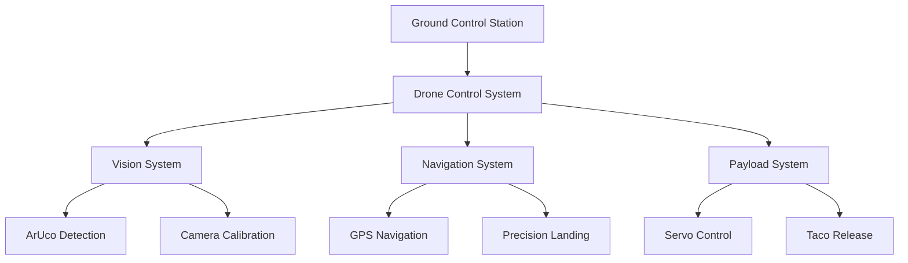
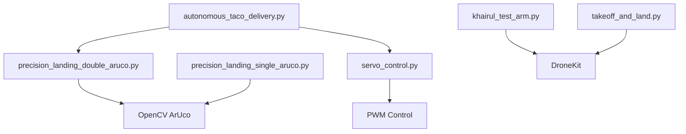
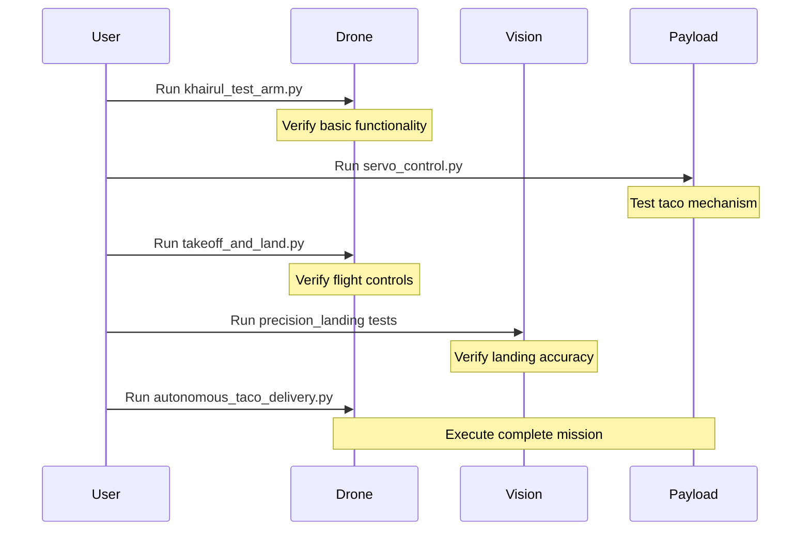

# Autonomous Taco Delivery System
## Author: Md Khairul Islam
- Institution: Hobart and William Smith Colleges, Geneva, NY
- Major: Robotics and Computer Science
- Contact: khairul.islam@hws.edu

## Project Overview

This project implements an autonomous drone delivery system capable of precise navigation, vision-based landing, and automated taco delivery. The system uses ArUco markers for precision landing and includes a complete delivery workflow from takeoff to return-to-home.

### Core Programs

1. **khairul_test_arm.py**
   - Basic vehicle arming test
   - Mode switching verification
   - Connection testing
   - Initial flight readiness check

2. **servo_control.py**
   - Servo mechanism control for payload
   - PWM signal calibration
   - Taco holding mechanism control
   - Position presets for pickup and delivery

3. **precision_landing_single_aruco.py**
   - Single ArUco marker detection
   - Basic landing sequence
   - Vision processing
   - Camera calibration integration

4. **precision_landing_double_aruco.py**
   - Dual ArUco marker system
   - Altitude-based marker switching
   - Enhanced precision landing
   - Advanced vision processing

5. **autonomous_taco_delivery.py**
   - Complete autonomous delivery workflow
   - Waypoint navigation
   - Payload management
   - Return-to-home functionality

6. **takeoff_and_land.py**
   - Basic flight testing
   - Simple takeoff sequence
   - Landing procedure verification
   - Flight mode testing

### System Architecture



## Usage Instructions

### 1. Basic Testing
```bash
# Test drone arming and basic controls
python khairul_test_arm.py

# Test servo mechanism for taco delivery
python servo_control.py

# Test basic takeoff and landing
python takeoff_and_land.py
```

### 2. Precision Landing Test
```bash
# Single marker precision landing test
python precision_landing_single_aruco.py

# Dual marker precision landing test
python precision_landing_double_aruco.py
```

### 3. Complete Delivery Mission
```bash
# Update coordinates in autonomous_taco_delivery.py
python autonomous_taco_delivery.py
```

### Program Dependencies



## Implementation Flow



## Technical Details

### ArUco Marker Configuration
- High Altitude Marker:
  * ID: 129
  * Size: 40cm
  * Usage: Initial approach
- Low Altitude Marker:
  * ID: 72
  * Size: 19cm
  * Usage: Final precision landing

### Camera Setup
```python
Camera Parameters:
- Resolution: 640x480
- FOV: 62.2° horizontal, 48.8° vertical
- Calibrated using OpenCV
```

### Servo Configuration
```python
Servo Parameters:
- Channel: 14
- PWM Range: 1100-1900
- Hold Position: 1100
- Release Position: 1900
```

### Flight Parameters
```python
Flight Settings:
- Takeoff Height: 8m
- Cruise Velocity: 0.5 m/s
- Landing Speed: 20 cm/s
- Delivery Wait Time: 10s
```

[Rest of the README remains the same with Safety Features, Troubleshooting, etc.]
